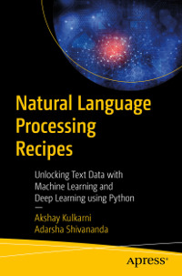

# NLP_Recipes

Natural Language Processing Recipes is your handy problem-solution reference for learning and implementing NLP solutions using python. This Repository is packed with thousands of code and approaches that help you to quick learn and implement the basic and advanced Natural Language Processing techniques, You will learn how to efficiently use a wide range of NLP Packages and implement text classification, identify parts of speech, topic modeling, text summarization, text generation, sentiment analysis and many more applications of NLP.

## Getting Started
1. Clone this repo    

2. See [Chapter 1: Extracting the Data](https://github.com/shubhamchouksey/NLP_Recipes/tree/master/Extract_Data) In this chapter, we are going to cover various sources of text data and ways to extract it, which can act as information or insights for businesses
   - Text Data collection using APIs
   - Reading PDF file in python
   - Reading word document
   - Reading JSON object
   - Reading HTML page and HTML parsing
   - Regular expressions
   - String handling
   - Web scraping

3. See [Chapter 2: Extracting and Processing Text Data](https://github.com/shubhamchouksey/NLP_Recipes/tree/master/Preprocessing) In this chapter, we are going to cover various methods and techniques to preprocess the text data along with exploratory data analysis.
   - Lowercasing
   - Punctuation removal
   - Stop words removal
   - Text standardization
   - Spelling correction
   - Tokenization
   - Lemmatization 
   - Exploratory data analysis
   - End-to-end processing pipeline
   
4. See [Chapter 3: Converting Text to Features](https://github.com/shubhamchouksey/NLP_Recipes/tree/master/Converting_text_to_features) In this chapter, we are going to cover basic to advanced feature engineering(text to features) methods
   - One Hot encoding
   - Count Vectorizer
   - N-grams
   - Co-occurence matrix
   - Hash vectorizer
   - Term Frequency-Inverse Document Frequency(TF-IDF)
   - Word embedding
   - Implementing fastText
  
5. See [Chapter 4: Advanced Natural Language Processing](https://github.com/shubhamchouksey/NLP_Recipes/tree/master/Advanced_Natural_Language_Processing) In this chapter, we are going to cover various advanced NLP techniques and leverage machine learning algorithm to extract information from text data as well as some of the Advanced NLP applications with the solution approach and implementation. 
   - Noun Phrase extraction
   - Text similarity
   - Parts of speech tagging
   - Information extraction - NER - Entity recognition
   - Topic Modeling
   - Text classification
   - Sentiment analysis
   - Word sense disambiguation
   - Speech recognition and speech to text
   - Text to speech
   - Language detection and translation
   
## Reference

[*Natural Language Processing Recipes*](https://www.apress.com/9781484242667) by Akshay Kulkarni and Adarsha Shivananda (Apress, 2019).

[comment]: #cover

